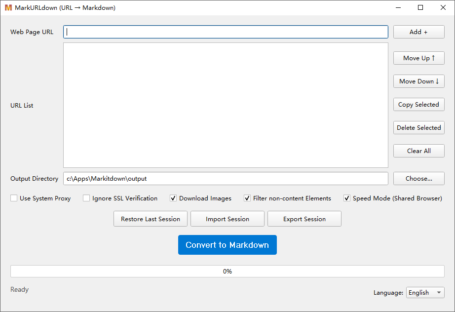

# MarkURLDown

MarkURLDown is a sophisticated desktop application designed to effortlessly convert web articles into clean, readable Markdown files. Built with a modular architecture and modern GUI framework, it's perfect for archiving content, creating a personal knowledge base.

## Screenshots




## Features

*   **Modern & Intuitive GUI:** A clean and responsive graphical interface built with PySide6.
*   **Multilingual Support:** Built-in support for English and Chinese (Simplified) with automatic language detection and easy switching.
*   **Batch Conversion:** Convert multiple URLs in a single session with progress tracking and real-time status updates.
*   **Smart Content Extraction:** Intelligently cleans up clutter like ads, navigation bars, and footers to grab only the main article content.
*   **Advanced Crawler Technology:** Multi-strategy crawler system with automatic fallback:
    *   **Playwright:** Modern browser automation for complex anti-bot scenarios
    *   **httpx:** High-performance HTTP/2 client for fast requests
    *   **Requests:** Lightweight HTTP client for simple scenarios
*   **Specialized Site Handlers:** Dedicated processors for complex websites:
    *   **WeChat Official Accounts:** Advanced handling with multi-strategy crawling and anti-detection measures
    *   **Zhihu Articles:** Specialized extraction for Zhihu columns and articles with authentication handling
    *   **WordPress Sites:** Optimized processing for WordPress-based websites
    *   **Next.js Blogs:** Tuned for common static Next.js blog themes
    *   **Generic Handler:** Intelligent fallback for all other websites
*   **Session Management:**
    *   **Auto-save:** Automatically saves your work session and restores it on next launch
    *   **Config Export/Import:** Export and import configuration settings for easy backup and sharing
    *   **Multiple Sessions:** Support for multiple named sessions for different projects
*   **Advanced Options:**
    *   **Proxy Support:** Configurable proxy settings with system proxy detection
    *   **SSL Verification:** Optional SSL certificate verification bypass for problematic sites
    *   **Image Handling:** Downloads all images from articles and saves them locally for complete, offline-first archives.
    *   **Filter non-content elements:** Removes typical site chrome (nav, header, footer, TOC, comments) before conversion for Generic Handler
    *   **Speed Mode (Shared Browser):** Reuse one Playwright browser per batch, new context per URL.

## Installation

To set up the project locally, you will need a working Python environment (Python 3.10+ recommended).

1.  **Clone the repository:**
    ```bash
    git clone <your-repository-url>
    cd Markitdown
    ```

2.  **Create and activate a virtual environment (recommended):**
    ```bash
    # Using venv
    python -m venv markitdown_env
    source markitdown_env/bin/activate  # On Windows: markitdown_env\Scripts\activate

    # Or using conda
    conda create --name markitdown python=3.10 -y
    conda activate markitdown
    ```

    Using uv (fast installer/runner):
    ```bash
    # Install uv (Linux/macOS)
    curl -LsSf https://astral.sh/uv/install.sh | sh
    # On Windows (PowerShell)
    iwr https://astral.sh/uv/install.ps1 -UseBasicParsing | iex

    # Create and activate venv
    uv venv
    # Linux/macOS (bash/zsh)
    source .venv/bin/activate
    # Windows (PowerShell)
    .\.venv\Scripts\Activate.ps1
    # Windows (Command Prompt)
    .venv\Scripts\activate
    ```

3.  **Install the required dependencies:**
    ```bash
    # Using pip
    pip install -r requirements.txt

    # Or using uv (faster)
    uv pip install -r requirements.txt
    ```

4.  **Install Playwright browsers (for advanced crawling):**
    ```bash
    playwright install
    ```

### Dependencies

The application uses the following key dependencies:

- **Core Dependencies:**
  - `markitdown` - Core HTML to Markdown conversion engine
  - `requests` - HTTP client for basic web requests
  - `beautifulsoup4` - HTML parsing and content extraction
  - `lxml` - Fast XML/HTML parser

- **Advanced Crawling:**
  - `httpx` - Modern HTTP/2 client for high-performance requests
  - `aiohttp` - Asynchronous HTTP client for concurrent image downloads
  - `playwright` - Browser automation for complex anti-bot scenarios

- **GUI Framework:**
  - `PySide6` - Modern Qt-based GUI framework

## Crawler Technology

MarkItDown features a sophisticated multi-strategy crawler system designed to handle various anti-bot scenarios:

### Multi-Strategy Approach
The application automatically tries multiple crawling strategies in order of reliability:

1. **Playwright Crawler** - Modern browser automation that can handle complex JavaScript rendering and anti-bot detection
2. **httpx Crawler** - High-performance HTTP/2 client for fast and efficient requests
3. **Requests Crawler** - Lightweight HTTP client for simple scenarios

### Automatic Fallback
If one strategy fails, the system automatically falls back to the next strategy, ensuring maximum success rates even when websites implement anti-bot measures.

### Specialized Site Support
- **WeChat Official Accounts**: Handles `poc_token` verification and complex page structures
- **Zhihu Articles**: Manages authentication challenges and specialized content extraction
- **Next.js Blogs (experimental)**: Optimized pipeline for static Next.js blog themes; currently enabled for `guangzhengli.com/blog`
- **General Websites**: Uses appropriate strategy based on site complexity

## Usage

Once installed, you can launch the application without needing to open a command line.

### Launching the Application

1.  Navigate to the project directory in your file explorer.
2.  Double-click the **`MarkItDown.vbs`** file.
3.  The application will start with a professional splash screen and then show the main window.

### Basic Usage

**Converting Articles:**
1.  Paste a URL into the top input field and click "Add +".
2.  Add as many URLs as you need to the list.
3.  Use the up/down arrows to reorder URLs if needed.
4.  Choose your desired output directory using the "Choose..." button.
5.  Configure your options:
    - **Download Images**: Downloads all images locally (slower but creates complete offline archives)
    - **Filter non-content elements**: Remove nav/header/footer/TOC/comments before conversion (recommended)
    - **Disable System Proxy**: Bypasses system proxy settings if needed
    - **Ignore SSL Verification**: Bypasses SSL certificate verification (use with caution)
6.  Click the "Convert to Markdown" button to begin the conversion process.

### Advanced Features

**Session Management:**
- **Auto-save**: Your current session (URLs, settings, output directory) is automatically saved when you close the application
- **Restore Last Session**: Click "Restore Last Session" to reload your previous work
- **Export/Import Config**: Use "Export Config" to save your settings and "Import Config" to load them later

**Language Support:**
- The application automatically detects your system language
- Switch between English and Chinese (Simplified) using the Language menu
- Language changes require a restart to take effect

**Batch Processing:**
- Add multiple URLs to process them in sequence
- Real-time progress tracking shows current status and completion percentage
- Stop conversion at any time using the "Stop Conversion" button
- Detailed status messages keep you informed of the conversion progress

## Acknowledgements

This project stands on the shoulders of giants. We would like to thank the developers of these outstanding open-source libraries:

*   **MarkItDown:** For the core Markdown conversion engine that powers the entire application.
*   **PySide6:** For the powerful and modern Qt-based GUI framework that provides the responsive user interface.
*   **Playwright:** For modern browser automation and handling complex anti-bot scenarios on challenging websites.
*   **httpx:** For high-performance HTTP/2 client capabilities and modern async support.
*   **aiohttp:** For asynchronous HTTP client functionality enabling concurrent image downloads.
*   **Requests:** For robust and simple HTTP requests with excellent session management.
*   **BeautifulSoup4:** For its excellence in parsing and navigating HTML content.
*   **lxml:** For fast and reliable XML/HTML parsing capabilities.

## License

This project is licensed under the **MIT License**. You are free to use, modify, and distribute it as you see fit.
